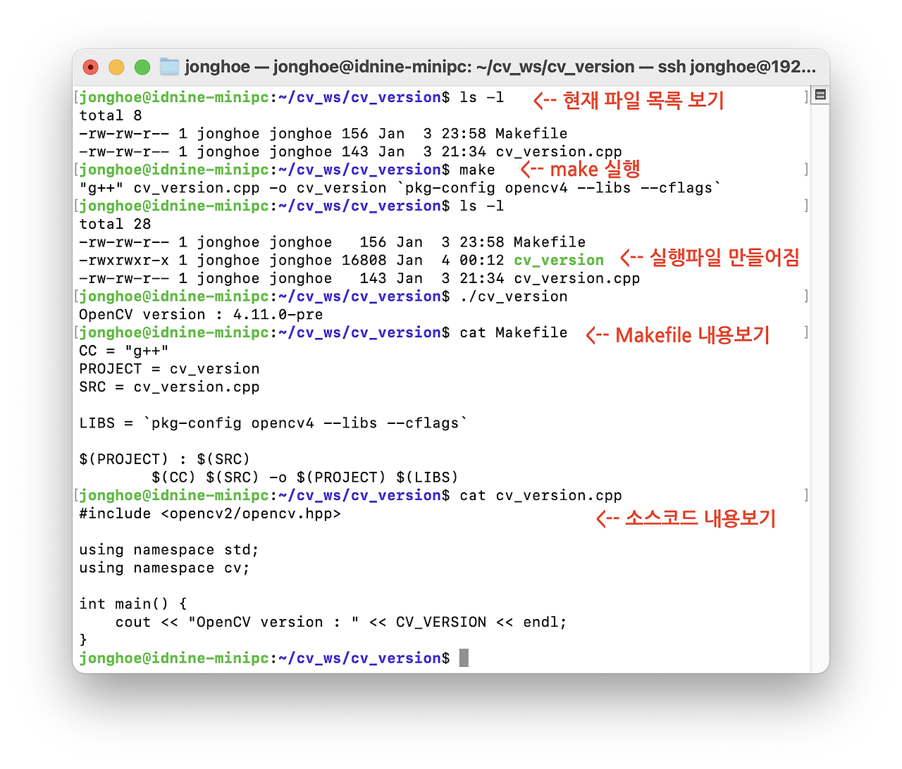

# OpenCV_C++로 설치 확인하기
- 리눅스에 OpenCV를 설치 후 잘 동작하는지, Build는 되는지 확인하는 과정이다.
- 작업 폴더(~/dev/prj1)를 하나 만들고 거기에 C++ 파일을 작성하고 컴파일 과정을 해본다.
- cv_version.cpp 파일을 작성한다.

```cpp title="cv_version.cpp" linenums="1" hl_lines="10"
//
// OpenCV Version Display
//
#include <opencv2/opencv.hpp>

using namespace std;
using namespace cv;

int main() {
    cout << "OpenCV Version : " << CV_VERSION << endl;
}
```

## 커맨더라인에서 컴파일 하기

```
g++ cv_version.cpp -o cv_version `pkg-config opencv4 --cflags --libs`
```

 컴파일이 끝나면 실행 파일을 실행한다

```
./cv_version
```


## Makefile 로 Build 하기
- 이 과정을 Makefile 을 만들어 하는 것이 더 좋다.
- 소스코드인 cv_version.cpp 파일이 있는 곳에 Makefile을 작성한다. 

```bash title="Makefile"
CC = "g++"
PROJECT = cv_version
SRC = cv_version.cpp

LIBS = `pkg-config opencv4 --cflags --libs`
$(PROJECT) : $(SRC)
	$(CC) $(SRC) -o $(PROJECT) $(LIBS)
```

- Makefile로 Build 하기, 그냥 작업폴더 bash 프롬프트에서 make 하면 된다.

```
make
```

- make가 끝나면 cv_version 이라는 실행 파일이 만들어져 있다.

```
./cv_version
```

실행하면 OpenCV 버전이 표시된다.


