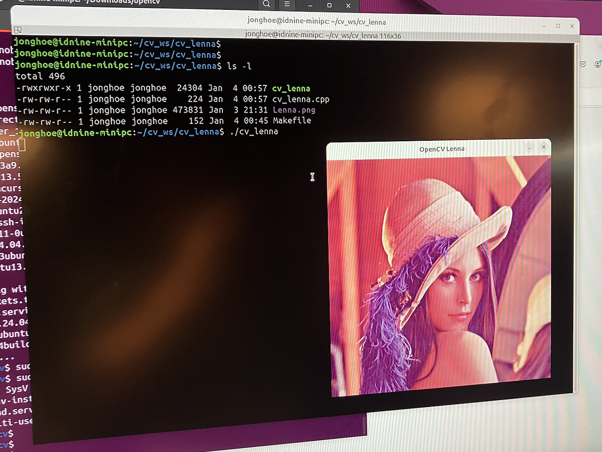

# OpenCV_그림 출력하기

OpenCV 설치가 잘 되었는지, 개발환경은 잘 세팅되었는지 확인용으로 사용하는 기본 프로그램이다.

- 리눅스 C++ 환경에서, OpenCV를 사용하고, Makefile로 Build 해서 이미지 출력하는 과정
- 여기서는 Lenna.png를 사용했는데 OpenCV 샘플 프로그램의 대표적인 샘플 이미지다.
- cv_lenna 라는 작업폴더를 만들고 시작한다. (~/dev/cv_lenna)
- 그림 파일은 작업 폴더에 저장한다.

## 코드 작성

```cpp title="cv_lenna.cpp" linenums="1"
//
// cv_lenna.cpp
//
#include <opencv2/opencv.hpp>

int main() {
    cv::Mat img;
    img = cv::imread("Lenna.png", cv::IMREAD_COLOR);
    cv::imshow("OpenCV Lenna", img);
    cv::waitKey(0);
    cv::destroyAllWindows();
}
```

```bash title="Makefile"
CC = "g++"
PROJECT = cv_lenna
SRC = cv_lenna.cpp

LIBS = `pkg-config opencv4 --cflags --libs`

$(PROJECT) : $(SRC)
	$(CC) $(SRC) -o $(PROJECT) $(LIBS)

```

## Build 하고 실행

소스코드와 Makefile 을 작성했으니, 이제 Make 하고 실행

```
make
./cv_lenna
```

하면 Lenna.png 파일이 출력된다.



## 추가 사항
- 막상 해 보면 에러가 나타날 수 있는데, 대부분 설치된 모듈이 없어서 발생하는 에러들이다.
- 화면에서 알려주는 대로 관련 모듈을 찾아 설치한다. (sudo apt install ..... )

