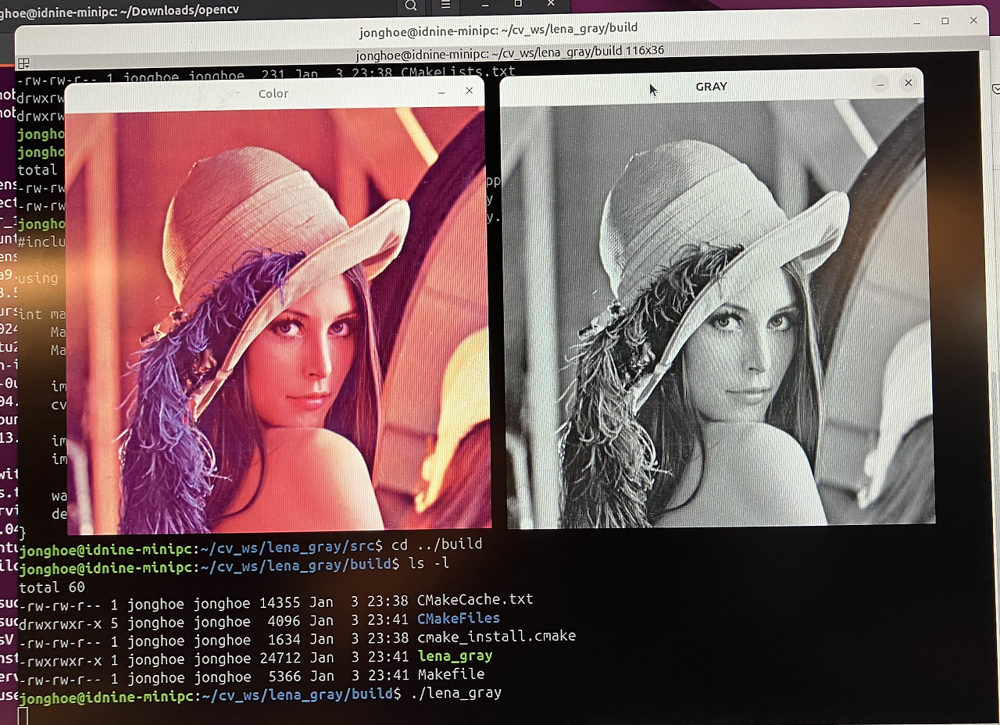

# CMake 사용하기

- C++로 개발할 때 Makefile 을 사용한 Build 방식이 일반적이다.
- 소스코드, 헤더파일 위치, 라이브러리 위치 등 컴파일러에게 알려줘야 할게 많기 때문이다.
- 그런데 Makefile로 하는 것 보다 더 복잡한 상황도 있어서 그런지
- OpenCV 개발환경에서는 CMake를 쓴다.
- OpenCV 설치할때 사용했던 게 CMake 였다.
- 이번에는 CMake를 사용해서 Build 해본다.

## CMake 개발환경 구조

CMake를 사용할 때 디렉토리 구조는 다음과 같이 구성한다.

```
project_dir --+-- src
              +-- data
              +-- build
```

- data 폴더는 없어도 상관 없지만, 기본 형식은 이렇다.
- project_dir 폴더에 CMakeLists.txt 를 작성한다.
- src 폴더에 .cpp 파일을 작성한다.
- data 폴더에 관련자료(이미지 파일)를 넣어둔다.
- build 폴더는 비워진 채로 만들어 놓기만 하면 된다.

```cpp title="lenna_gray.cpp" linenums="1"
#include <opencv2/opencv.hpp>

using namespace cv;

int main() {
    Mat img;
    Mat img_gray;
    
    img = imread("../data/Lenna.png", IMREAD_COLOR);
    cvtColor(img, img_gray, COLOR_BGR2GRAY);
    
    imshow("Color", img);
    imshow("Gray", img_gray);
    
    waitKey(0);
    destroyAllWindows();
}
```

```bash title="CMakeLists.txt" linenums="1"
cmake_minimum_required(VERSION 3.10)
project(lena_gray)
find_package(OpenCV REQUIRED)
add_executable(lena_gray src/lena_gray.cpp)
include_directories(include ${OpenCV_INCLUDE_DIRS})
target_link_libraries(lena_gray ${OpenCV_LIBS})
```

## 빌드하기

```
cd build        <-- project_dir/build 폴더에서 시작, 빈 폴더 임
cmake ..        <-- CMake로 빌드하기, Makefile과 몇가지 관련 파일들을 만든다
make            <-- 생성된 Makefile에 의해 실행파일 만든다
./lena_gray     <-- 프로그램 실행, build 디렉토리에 들어있다.
```

그렇다.

## 추가 사항

Makefile 보다 CMake를 더 많이 사용하는 추세라고 한다. 각자 편한쪽으로.

